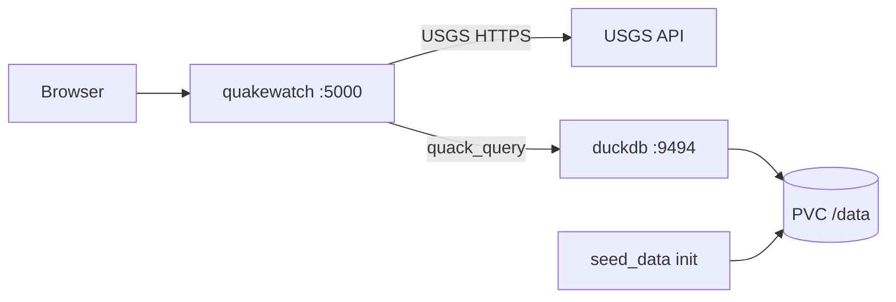

# Final project — QuakeWatch

Docker image and Kubernetes manifests for a customized [QuakeWatch](https://github.com/EduardUsatchev/QuakeWatch) Flask app (namespace `final-project`).

The upstream project queries live earthquake data from the USGS API. This fork extends it with a **DuckDB + Quack** backend: historical earthquake statistics are served from a local database while the web UI still uses USGS for graphs and recent events.

## Architecture



| Service | Role |
| ------- | ---- |
| **quakewatch** | Flask web app (`app.py`) — dashboards, USGS graphs, health routes |
| **duckdb** | DuckDB Quack server (`duckdb-quack-service.py`) — read-only `earthquakes` table over the Quack protocol |

Docker Compose runs both services locally. Kubernetes deploys them as separate Deployments with a shared ConfigMap, Secret, and PersistentVolume for the database file.

## DuckDB data layer

Historical statistics on `/graph-earthquakes` come from a local **DuckDB** database, not from the USGS API. [DuckDB Quack](https://duckdb.org/docs/current/quack/overview) exposes the database as a separate service that `quakewatch` queries over the network — the same separation pattern used in Docker Compose and Kubernetes.

In Docker Compose and Kubernetes, seeding and service startup are automated (`seed_data.py`, `duckdb-quack-service.py`). The manual steps below are for building or debugging the database outside those environments.

### Dataset

Historical earthquake records come from the Kaggle dataset [All the Earthquakes Dataset: from 1990–2023](https://www.kaggle.com/datasets/alessandrolobello/the-ultimate-earthquake-dataset-from-1990-2023), stored in Parquet format under `seed-data/Earthquakes-1990-2023.parquet` (observation period **1990–2023**).

In deployed environments, `seed_data.py` downloads the parquet file from the course repository and creates the `earthquakes` table in `earthquakes.duckdb` if it does not already exist.

### Why DuckDB?

- Good trade-off between complexity and performance for analytical queries on a single-node dataset.
- Quack provides a protocol for remote access, enabling separation between the database service and the web application.
- The official [DuckDB Docker image](https://hub.docker.com/r/duckdb/duckdb/) targets the CLI, not a long-running service — this project runs Quack from Python inside the application image instead.

### Analytics

The fork enriches the upstream app with statistics for the selected map area on `/graph-earthquakes`:

- Median earthquake magnitude in the area
- Average time between earthquakes
- Details of the highest-magnitude earthquake (time, place, magnitude)

Queries run remotely from `quakestats.py` via `quack_query()`. The Quack token is supplied through `QUACK__TOKEN` (Kubernetes Secret or Compose environment variable).

### Manual setup

**Download seed data** — install `gdown`, then fetch the parquet file:

```bash
pip install gdown
gdown https://drive.google.com/uc?id=12iG4h8tdYXJCPwYz8EMzBScbPioq5Evv
```

Move the file to `seed-data/Earthquakes-1990-2023.parquet` if needed.

**Data service:**

```python
import duckdb

conn = duckdb.connect("seed-data/earthquakes.duckdb")
conn.sql("CREATE TABLE earthquakes AS SELECT * FROM 'seed-data/Earthquakes-1990-2023.parquet'")
duckdb.sql("FORCE INSTALL quack FROM core_nightly; LOAD quack")
conn.sql("CALL quack_serve('quack:0.0.0.0:9494', allow_other_hostname => true, disable_ssl => true);")
```

Expected output includes a generated auth token:

```
┌────────────────────┬─────────────────────┬──────────────────────────────────┐
│     listen_uri     │     listen_url      │            auth_token            │
│      varchar       │       varchar       │             varchar              │
├────────────────────┼─────────────────────┼──────────────────────────────────┤
│ quack:0.0.0.0:9494 │ http://0.0.0.0:9494 │ 3DCA7EE39EEF5309959AF0DC07C1FA75 │
└────────────────────┴─────────────────────┴──────────────────────────────────┘
```

Use the token in client queries and in `QUACK__TOKEN` when configuring the app.

**Client:**

```python
import duckdb

conn = duckdb.connect(":memory:")
conn.sql("""
    FROM quack_query(
        'quack:duckdb',
        'SELECT * FROM main.earthquakes LIMIT 1',
        token='3DCA7EE39EEF5309959AF0DC07C1FA75',
        disable_ssl => true
    )
""")
```

Replace `duckdb` with your Quack server hostname and use the token from `quack_serve` output (or from the Kubernetes Secret in deployed environments).

## Customizations from upstream QuakeWatch

Application source lives in **`Quakewatch/`** (fork of [EduardUsatchev/QuakeWatch](https://github.com/EduardUsatchev/QuakeWatch)).

| Change | Details |
| ------ | ------- |
| **Remote DuckDB stats** | New `quakestats.py` — `QuakeStats` queries the remote DB via `quack_query()` using `QUACK__HOST`, `QUACK__PORT`, and `QUACK__TOKEN` |
| **Quack server** | New `duckdb-quack-service.py` — serves `earthquakes.duckdb` with `quack_serve()` on port 9494 |
| **Seed data** | New `seed_data.py` — downloads `Earthquakes-1990-2023.parquet` and creates the `earthquakes` table if missing |
| **Dashboard** | `dashboard.py` — `/graph-earthquakes` uses `QuakeStats` for median magnitude, time-between-quakes, and max event in the selected area |
| **Templates** | `graph_dashboard.html` — statistics cards for the selected region |
| **Dependencies** | `requirements.txt` — added `duckdb`, `pandas` |
| **Image build** | `Dockerfile` — pre-installs DuckDB `spatial` extension |
| **Compose** | `docker-compose.yml` — two services (`quakewatch` + `duckdb`), shared Quack token, bind-mounted `seed-data` volume |
| **Seed dataset** | `seed-data/Earthquakes-1990-2023.parquet` — historical earthquake records |

Environment variables (double underscore convention):

| Variable | Used by | Purpose |
| -------- | ------- | ------- |
| `QUAKEWATCH__LOG_PATH` | `app.py` | Rotating log directory |
| `MPLCONFIGDIR` | `app.py` (matplotlib) | Writable matplotlib cache path |
| `QUACK__HOST` | `quakestats.py` | DuckDB service hostname (`duckdb` in K8s) |
| `QUACK__PORT` | `quakestats.py`, `duckdb-quack-service.py` | Quack protocol port (`9494`) |
| `QUACK__TOKEN` | `quakestats.py`, `duckdb-quack-service.py` | Shared auth token (Secret in K8s) |
| `DUCKDB__PATH` | `seed_data.py`, `duckdb-quack-service.py` | Path to DuckDB file on disk |

## Files and folders

### Root — Docker

| File | Purpose |
| ---- | ------- |
| [Dockerfile](Dockerfile) | Builds `mlsokolova/quakewatch` from `python:3.11-slim` and `Quakewatch/` |
| [docker-compose.yml](docker-compose.yml) | Runs `quakewatch` (port 5000) and `duckdb` (ports 5001, 9494) with shared seed volume |

### `helm/`

| File | Purpose |
| ---- | ------- |
| [Chart.yaml](helm/Chart.yaml) | Helm chart metadata |
| [values.yaml](helm/values.yaml) | Default configuration for all templates |
| [templates/](helm/templates/) | Templated manifests (equivalent to `kubernetes/`) |

Install: `helm install quakewatch ./helm -n final-project --create-namespace` — see [3-Helm.md](docs/3-Helm.md).

### `kubernetes/`

| File | Purpose |
| ---- | ------- |
| [quakewatch.yaml](kubernetes/quakewatch.yaml) | `Deployment` + `NodePort` `Service` for the web app; init container waits for DuckDB Quack |
| [duckdb.yaml](kubernetes/duckdb.yaml) | `Deployment` + `ClusterIP` `Service` for DuckDB Quack; init container runs `seed_data.py` |
| [configmap-quakewatch.yaml](kubernetes/configmap-quakewatch.yaml) | Non-sensitive config (`QUAKEWATCH__LOG_PATH`, `MPLCONFIGDIR`, `QUACK__HOST`, `QUACK__PORT`, `DUCKDB__PATH`) |
| [secret-quakewatch.yaml](kubernetes/secret-quakewatch.yaml) | `QUACK__TOKEN` |
| [pv-duckdb.yaml](kubernetes/pv-duckdb.yaml) | `PersistentVolume` + `PersistentVolumeClaim` for `/data` (DuckDB file) |
| [cronjob-quakewath-check.yaml](kubernetes/cronjob-quakewath-check.yaml) | `CronJob` health check via `curl` to `/graph-earthquakes` |
| [hpa-quakewatch.yaml](kubernetes/hpa-quakewatch.yaml) | Horizontal Pod Autoscaler for `quakewatch` |
| [components.yaml](kubernetes/components.yaml) | [metrics-server](https://github.com/kubernetes-sigs/metrics-server) v0.8.1 with `--kubelet-insecure-tls` (local clusters) |

### `Quakewatch/`

| File | Purpose |
| ---- | ------- |
| `app.py` | Flask app factory, logging setup |
| `dashboard.py` | HTTP routes (`/health`, `/ping`, earthquake pages, USGS APIs, `QuakeStats` integration) |
| `quakestats.py` | Remote DuckDB queries via Quack |
| `duckdb-quack-service.py` | DuckDB Quack server entrypoint |
| `seed_data.py` | Parquet download and table bootstrap |
| `utils.py` | Country/region settings, matplotlib graphs, USGS helpers |
| `requirements.txt` | Python dependencies |
| `templates/` | Jinja2 HTML (`base.html`, main and graph dashboards) |
| `static/` | Static assets (logo) |

### `seed-data/`

| File | Purpose |
| ---- | ------- |
| `Earthquakes-1990-2023.parquet` | Source dataset; loaded into DuckDB by `seed_data.py` |

### `docs/`

| File | Purpose |
| ---- | ------- |
| [1-Docker.md](docs/1-Docker.md) | Phase 1: build, run, compose, push image tag `3.2.0` |
| [2-Kubernetes.md](docs/2-Kubernetes.md) | Phase 2: namespace, ConfigMap, Secret, PV, DuckDB + QuakeWatch deploy, CronJob, HPA |
| [3-Helm.md](docs/3-Helm.md) | Phase 3: Helm chart install, upgrade, uninstall |
| [install-kubernetes-cluster.pdf](docs/install-kubernetes-cluster.pdf) | Docker Desktop Kubernetes on Windows 11 |

## Docker Image versioning
Docker image is uploaded to Docker Hub repo `mlsokolova` during  execution of the GitHub Actions Workflow `main-merge.yaml`, on merge a branch into `main` branch.   
Tag(version) of the docker image come from branch name.

## Quick start — Kubernetes

Run from the `final-project` directory:

```bash
kubectl create ns final-project
kubectl config set-context --current --namespace=final-project

kubectl apply -f kubernetes/configmap-quakewatch.yaml
kubectl apply -f kubernetes/secret-quakewatch.yaml
kubectl apply -f kubernetes/pv-duckdb.yaml
kubectl apply -f kubernetes/duckdb.yaml
kubectl apply -f kubernetes/quakewatch.yaml
```

Image tag: `mlsokolova/quakewatch:3.2.0`

